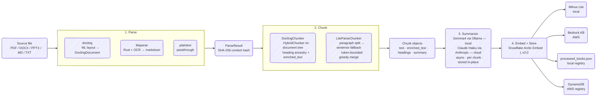

# Search Anything

RAG for personal knowledge base.

## Features

- **Multi-format ingestion** — PDF, DOCX, PPTX, Markdown, plain text
- **Pluggable parsers** — `docling` (ML layout model) or `liteparse` (Rust + Tesseract OCR)
- **Structure-native chunking** — DoclingChunker operates on the live DoclingDocument tree; LiteParseChunker uses paragraph-boundary splitting with sentence-level fallback
- **Heading-contextualized embeddings** — heading path prepended to each chunk before embedding
- **Per-chunk summaries** — Gemma4 (local) or Claude Haiku (cloud) summarizes each chunk at index time; summaries stored in Milvus and returned at retrieval
- **Idempotent pipeline** — SHA-256 content hash prevents double-ingestion
- **File watcher** — `watch` auto-ingests files dropped into `books/`
- **Dual backend** — `local` (Milvus Lite + Ollama) or `aws` (Bedrock + DynamoDB)

## Setup

```bash
python -m venv .venv && source .venv/bin/activate
pip install -e .           # local backend
pip install -e ".[aws]"    # + AWS backend
cp .env.example .env
```

Pull the local LLM:
```bash
ollama pull gemma4:e4b
```

## Indexing Pipeline



## Commands

```bash
python main.py ingest                                    # ingest all files in books/
python main.py ingest --paths books/a.pdf books/b.pdf   # specific files
python main.py ask "What is gradient descent?"           # query
python main.py watch                                     # watch books/ and auto-ingest
```

Files already in the registry (matched by content hash + parser) are skipped.

## Configuration

All tunables are in [src/rag/config.py](src/rag/config.py), overridable via `.env`. See [.env.example](.env.example) for the full list.

| Variable | Default | Description |
|---|---|---|
| `CLOUD_BACKEND` | `local` | `local` or `aws` |
| `LOCAL_PARSER` | `liteparse` | `liteparse` or `docling` |
| `LOCAL_CHUNKER` | `liteparse` | `liteparse` or `docling` |
| `CHUNK_MAX_TOKENS` | `1024` | Hard token ceiling per chunk |
| `LOCAL_SUMMARY_MODEL` | `gemma4:e4b` | Ollama model for summarization (local) |
| `CLOUD_SUMMARY_MODEL` | `claude-haiku-4-5-20251001` | Anthropic model for summarization (cloud) |
| `LOCAL_SYNTHESIS_MODEL` | `gemma4:e4b` | Ollama model for answer synthesis (local) |
| `CLOUD_SYNTHESIS_MODEL` | `claude-sonnet-4-6` | Anthropic model for answer synthesis (cloud) |
| `LOCAL_LLM_BASE_URL` | `http://localhost:11434` | Ollama server URL |
| `RETRIEVAL_K` | `10` | Chunks retrieved per query |
