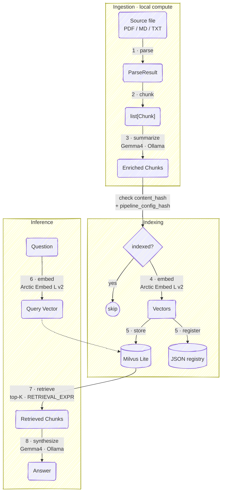
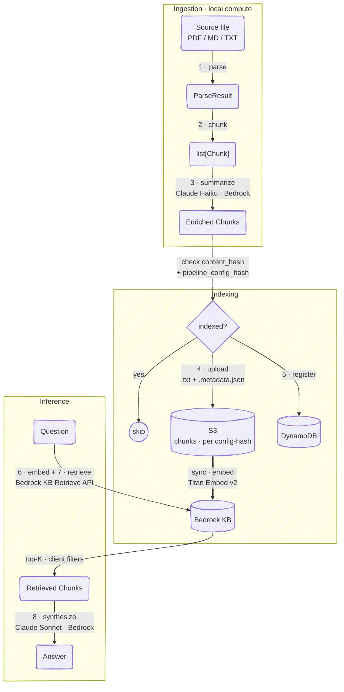

# Search Anything

RAG for personal knowledge base.

## Features

- **Multi-format ingestion** — PDF, Markdown, plain text
- **Pluggable parsers** — `docling` (ML layout model) or `liteparse` (Rust + Tesseract OCR)
- **Structure-native chunking** — DoclingChunker operates on the live DoclingDocument tree; LiteParseChunker uses paragraph-boundary splitting with sentence-level fallback
- **Heading-contextualized embeddings** — heading path prepended to each chunk before embedding
- **Per-chunk summaries** — Gemma4 (local) or Claude Haiku (cloud) summarizes each chunk at index time; summaries stored with each chunk and returned at retrieval
- **Citation metadata** — retrieved chunks carry source `page_numbers` (docling), plus `chunk_index` / `total_chunks` / `chunk_id`
- **Versioned pipeline** — a `pipeline_config_hash` fingerprints every method decision (parser, chunker, chunk settings, embedding + summary models); changing any of them yields a fresh version instead of silently reusing stale artifacts
- **Idempotent pipeline** — dedup keyed on `content_hash` + `pipeline_config_hash` prevents double-ingestion
- **File watcher** — `watch` auto-ingests files dropped into `books/`
- **Dual backend** — `local` (Milvus Lite + Ollama) or `aws` (Bedrock KB + S3 + DynamoDB)

## Setup & Commands

### Setup — install dependencies

```bash
brew install uv        # install uv (skip if already installed)
uv sync                # local backend
uv sync --extra aws    # add AWS backend
cp .env.example .env   # ensure HF_TOKEN (required to download Arctic Embed)
ollama pull gemma4:e4b # local LLM for summarization + synthesis
```

### AWS backend setup (only for `CLOUD_BACKEND=aws`)

Setup the followings before ingesting:

- **AWS credentials** configured for S3, DynamoDB, and Bedrock.
- **S3 bucket** (`S3_BUCKET`) — stores per-chunk `.txt` + `.metadata.json` sidecars under `chunks/{pipeline_config_hash}/`.
- **DynamoDB table** (`DYNAMODB_TABLE`) — composite key **PK `content_hash` (String)**, **SK `pipeline_config_hash` (String)**.
- **Bedrock Knowledge Base** (`BEDROCK_KNOWLEDGE_BASE_ID`) with an **S3 data source** (`BEDROCK_DATA_SOURCE_ID`) configured with `chunkingStrategy=NONE` (we pre-chunk).
- **Bedrock model access** enabled for the embedding model (Titan Embed Text v2) and the Claude summary/synthesis models.

### Commands — run the pipelines

```bash
uv run main.py ingest [--paths FILE ...]       # ingest all files in books/ or specific files via --paths
uv run main.py ask "What is gradient descent?" # query
uv run main.py watch                           # watch books/ and auto-ingest
```

> **Note**: Re-running ingest is safe — already-processed files are skipped. A file is considered "already processed" when its `content_hash` (SHA-256 of the raw file bytes) **and** its `pipeline_config_hash` both match an existing entry. The `pipeline_config_hash` fingerprints every method decision in the pipeline (parser, chunker, chunk settings, embedding + summary models), so changing *any* of them — not just the parser — re-processes the file as a new version. On the AWS backend, `ingest` blocks until the Bedrock KB sync job reports `COMPLETE` (failing on `FAILED`/timeout), so a document is registered only after its chunks are actually searchable.

## Document identity & versioning

A document's identity is modeled on two axes:

| Concept | Meaning | Managed by |
|---|---|---|
| `filename` | **logical document identity** — the stable handle for a document | you (keep filenames unique) |
| `content_hash` | **version** of that document (SHA-256 of the bytes) within a config | **supersede** — automatic, at ingest |
| `pipeline_config_hash` | **processing generation** (parser/chunker/embedding/summary config) | **prune** — manual (see below) |

**Filename is the identity; content_hash is the version.** Two files with the same name are treated as the same document at different versions — so **filenames must be unique** (the system trusts this; it cannot distinguish an edited version from a genuinely different document that happens to share a name).

**Supersede (automatic).** When you ingest a file whose name already exists under the current config but with *different* content, the older version's indexed data (chunks, vectors, registry row) is removed **in the same sync that adds the new version** — so a query never sees two versions of the same document at once. Re-ingesting an *identical* file (same `content_hash`) is a no-op, skipped by the idempotency check. Supersede is scoped to the **current** `pipeline_config_hash`.

**Prune (manual).** Copies of a document indexed under an *older* `pipeline_config_hash` are not touched by supersede — they remain in storage (invisible to queries via the config-scoped retrieval filter) until removed by config-level pruning.

## Pipelines

Both backends run the same eight logical steps. **Parsing and chunking are always local compute** — the backend only changes the models and infrastructure from **summarize** onward. The table compares them step by step; the tabs below show each backend's full end-to-end flow.

| # | Step | Local | AWS |
|---|---|---|---|
| 1 | parse | docling / liteparse / plaintext | ← same (local) |
| 2 | chunk | DoclingChunker / LiteParseChunker | ← same (local) |
| 3 | summarize | Gemma4 · Ollama | Claude Haiku · Bedrock |
| 4 | embed | Arctic Embed L v2 · HuggingFace | Titan Embed Text v2 · Bedrock KB (managed) |
| 5 | store + register | Milvus Lite + JSON registry | S3 → Bedrock KB + DynamoDB |
| 6 | embed query | Arctic Embed L v2 | Titan Embed Text v2 · KB-managed |
| 7 | retrieve | Milvus `similarity_search` + `RETRIEVAL_EXPR` | Bedrock KB Retrieve + client-side filters |
| 8 | synthesize | Gemma4 · Ollama | Claude Sonnet · Bedrock |

<details open>
<summary><b>🖥️ Local Backend</b></summary>



</details>

<details>
<summary><b>☁️ AWS Backend</b></summary>



</details>

## Configuration

All tunables are in [src/rag/config.py](src/rag/config.py), overridable via `.env`. See [.env.example](.env.example) for the full list.

### Backend

| Variable | Default | Description |
|---|---|---|
| `CLOUD_BACKEND` | `local` | `local` or `aws` |

### Ingestion

| Variable | Default | Description |
|---|---|---|
| `LOCAL_PARSER` | `docling` | `liteparse` or `docling` |
| `PARSER_ENABLE_OCR` | `true` | Run OCR on pages without a text layer |
| `LOCAL_CHUNKER` | `docling` | `liteparse` or `docling` |
| `CHUNK_TOKENIZER` | `Snowflake/snowflake-arctic-embed-l-v2.0` | Tokenizer for token counting; keep equal to embedding model |
| `CHUNK_MAX_TOKENS` | `1024` | Hard token ceiling per chunk |
| `CHUNK_MERGE_PEERS` | `true` | Merge undersized adjacent chunks under the same heading |
| `CHUNK_MERGE_LIST_ITEMS` | `true` | Keep consecutive list items together in one chunk |
| `LOCAL_LLM_BASE_URL` | `http://localhost:11434` | Ollama server URL |
| `LOCAL_SUMMARY_MODEL` | `gemma4:e4b` | Local summarization model (Ollama) |
| `CLOUD_SUMMARY_MODEL` | `us.anthropic.claude-haiku-4-5-20251001` | Cloud summarization model (Bedrock cross-region id) |

### Indexing

| Variable | Default | Description |
|---|---|---|
| `MILVUS_INDEX_TYPE` | `FLAT` | `FLAT` / `HNSW` / `IVF_FLAT` / `IVF_SQ8` / `IVF_PQ` |
| `MILVUS_METRIC_TYPE` | `COSINE` | `COSINE` / `L2` / `IP` |
| `MILVUS_HNSW_M` | `16` | HNSW edges per node (4–64); used when `INDEX_TYPE=HNSW` |
| `MILVUS_HNSW_EF_CONSTRUCTION` | `200` | HNSW build-time search scope (8–512) |
| `MILVUS_IVF_NLIST` | `128` | IVF clusters (~sqrt of vector count); used when `INDEX_TYPE=IVF_*` |

### Inference

| Variable | Default | Description |
|---|---|---|
| `RETRIEVAL_K` | `10` | Top-K chunks returned per query |
| `RETRIEVAL_EXPR` | `headings != 'Contents'` | Milvus boolean filter expression (**local only** — ignored by AWS) |
| `RETRIEVAL_EXCLUDE_HEADINGS` | `Contents` | Comma-separated headings dropped from AWS retrieval (client-side; the AWS equivalent of `RETRIEVAL_EXPR`) |
| `LOCAL_SYNTHESIS_MODEL` | `gemma4:e4b` | Local answer-synthesis model (Ollama) |
| `CLOUD_SYNTHESIS_MODEL` | `us.anthropic.claude-sonnet-4-6-20250514` | Cloud answer-synthesis model (Bedrock cross-region id) |

### Secrets & AWS

| Variable | Default | Description |
|---|---|---|
| `HF_TOKEN` | — | HuggingFace token, required to download Arctic Embed |
| `ANTHROPIC_API_KEY` | — | Optional/legacy — **not** used by the AWS backend (which authenticates via IAM) or the local backend (Ollama) |
| `AWS_REGION` | `us-west-2` | AWS region for S3 + DynamoDB |
| `S3_BUCKET` | — | S3 bucket for per-chunk `.txt` + `.metadata.json` sidecars |
| `DYNAMODB_TABLE` | — | DynamoDB table backing the registry (PK `content_hash`, SK `pipeline_config_hash`) |
| `BEDROCK_REGION` | `us-west-2` | AWS region for Bedrock (KB, embeddings, LLM) |
| `BEDROCK_KNOWLEDGE_BASE_ID` | — | Bedrock Knowledge Base id (retrieval + sync) |
| `BEDROCK_DATA_SOURCE_ID` | — | S3 data source id within the KB (ingestion-job target) |
| `BEDROCK_EMBED_MODEL_ID` | `amazon.titan-embed-text-v2:0` | KB embedding model; must match the model the KB was created with |
| `KB_SYNC_POLL_INTERVAL` | `5` | Seconds between KB ingestion-job status checks |
| `KB_SYNC_TIMEOUT` | `600` | Max seconds to wait for a KB sync before failing |
