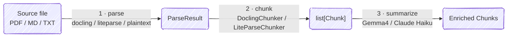
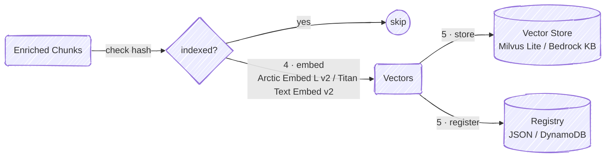
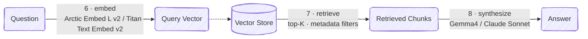

# Search Anything

RAG for personal knowledge base.

## Features

- **Multi-format ingestion** — PDF, Markdown, plain text
- **Pluggable parsers** — `docling` (ML layout model) or `liteparse` (Rust + Tesseract OCR)
- **Structure-native chunking** — DoclingChunker operates on the live DoclingDocument tree; LiteParseChunker uses paragraph-boundary splitting with sentence-level fallback
- **Heading-contextualized embeddings** — heading path prepended to each chunk before embedding
- **Per-chunk summaries** — Gemma4 (local) or Claude Haiku (cloud) summarizes each chunk at index time; summaries stored in Milvus and returned at retrieval
- **Idempotent pipeline** — SHA-256 content hash prevents double-ingestion
- **File watcher** — `watch` auto-ingests files dropped into `books/`
- **Dual backend** — `local` (Milvus Lite + Ollama) or `aws` (Bedrock + DynamoDB)

## Setup & Commands

### Setup — install dependencies

```bash
brew install uv        # install uv (skip if already installed)
uv sync                # local backend
uv sync --extra aws    # add AWS backend
cp .env.example .env   # ensure HF_TOKEN (required) and ANTHROPIC_API_KEY (cloud only)
ollama pull gemma4:e4b # local LLM for summarization + synthesis
```

### Commands — run the pipelines

```bash
uv run main.py ingest [--paths FILE ...]       # ingest all files in books/ or specific files via --paths
uv run main.py ask "What is gradient descent?" # query
uv run main.py watch                           # watch books/ and auto-ingest
```

> **Note**: Re-running ingest is safe — already-processed files are skipped. A file is considered "already processed" when its `content_hash` (SHA-256 of the raw file bytes) plus the `parser` used both match an existing entry. Re-ingesting the same file with a different parser (e.g. switching `LOCAL_PARSER` from `liteparse` to `docling`) will re-process it as a separate entry.

## Pipelines

### Ingestion



### Indexing



### Inference



## Configuration

All tunables are in [src/rag/config.py](src/rag/config.py), overridable via `.env`. See [.env.example](.env.example) for the full list.

### Backend

| Variable | Default | Description |
|---|---|---|
| `CLOUD_BACKEND` | `local` | `local` or `aws` |

### Ingestion

| Variable | Default | Description |
|---|---|---|
| `LOCAL_PARSER` | `liteparse` | `liteparse` or `docling` |
| `PARSER_ENABLE_OCR` | `true` | Run OCR on pages without a text layer |
| `LOCAL_CHUNKER` | `liteparse` | `liteparse` or `docling` |
| `CHUNK_TOKENIZER` | `Snowflake/snowflake-arctic-embed-l-v2.0` | Tokenizer for token counting; keep equal to embedding model |
| `CHUNK_MAX_TOKENS` | `1024` | Hard token ceiling per chunk |
| `CHUNK_MERGE_PEERS` | `true` | Merge undersized adjacent chunks under the same heading |
| `CHUNK_MERGE_LIST_ITEMS` | `true` | Keep consecutive list items together in one chunk |
| `LOCAL_LLM_BASE_URL` | `http://localhost:11434` | Ollama server URL |
| `LOCAL_SUMMARY_MODEL` | `gemma4:e4b` | Local summarization model (Ollama) |
| `CLOUD_SUMMARY_MODEL` | `claude-haiku-4-5-20251001` | Cloud summarization model (Anthropic) |

### Indexing

| Variable | Default | Description |
|---|---|---|
| `MILVUS_INDEX_TYPE` | `FLAT` | `FLAT` / `HNSW` / `IVF_FLAT` / `IVF_SQ8` / `IVF_PQ` |
| `MILVUS_METRIC_TYPE` | `COSINE` | `COSINE` / `L2` / `IP` |
| `MILVUS_HNSW_M` | `16` | HNSW edges per node (4–64); used when `INDEX_TYPE=HNSW` |
| `MILVUS_HNSW_EF_CONSTRUCTION` | `200` | HNSW build-time search scope (8–512) |
| `MILVUS_IVF_NLIST` | `128` | IVF clusters (~sqrt of vector count); used when `INDEX_TYPE=IVF_*` |

### Inference

| Variable | Default | Description |
|---|---|---|
| `RETRIEVAL_K` | `10` | Top-K chunks returned per query |
| `RETRIEVAL_EXPR` | `headings != 'Contents'` | Milvus boolean filter expression |
| `LOCAL_SYNTHESIS_MODEL` | `gemma4:e4b` | Local answer-synthesis model (Ollama) |
| `CLOUD_SYNTHESIS_MODEL` | `claude-sonnet-4-6` | Cloud answer-synthesis model (Anthropic) |

### Secrets & AWS

| Variable | Default | Description |
|---|---|---|
| `HF_TOKEN` | — | HuggingFace token, required to download Arctic Embed |
| `ANTHROPIC_API_KEY` | — | Anthropic API key, required for `CLOUD_BACKEND=aws` |
| `AWS_REGION` | `us-west-2` | AWS region for S3 + DynamoDB |
| `S3_BUCKET` | — | S3 bucket for raw source files |
| `DYNAMODB_TABLE` | — | DynamoDB table backing the registry |
| `BEDROCK_REGION` | `us-west-2` | AWS region for Bedrock (embeddings + LLM) |
