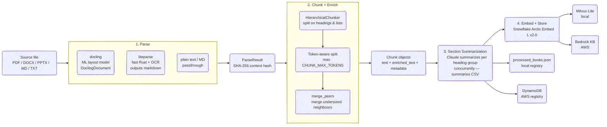

# Search Anything

RAG for personal knowledge base.

## Features

- **Multi-format ingestion** — PDF, DOCX, PPTX, Markdown, and plain text
- **Pluggable parsers** — `docling` (ML layout model, default) or `liteparse` (fast native Rust + Tesseract OCR), switchable via `LOCAL_PARSER`
- **Structure-native chunking** — DoclingChunker operates on the live DoclingDocument tree (no markdown round-trip); heading ancestry is derived directly from docling's semantic structure
- **Heading-contextualized embeddings** — `chunker.contextualize()` prefixes each chunk with its heading path before embedding, materially improving retrieval quality for section-level queries
- **Section summaries** — async per-heading summaries stored alongside chunks for richer retrieval context
- **Idempotent pipeline** — SHA-256 content hash prevents double-ingestion
- **File watcher** — `watch` command auto-ingests files dropped into `books/`
- **Dual backend** — `local` (Milvus Lite + Anthropic API) or `aws` (Bedrock + DynamoDB), switched via `CLOUD_BACKEND`

## Setup

```bash
python -m venv .venv
source .venv/bin/activate

pip install -e .          # local backend
pip install -e ".[aws]"   # + AWS backend (S3 + DynamoDB + Bedrock)
```

Copy `.env.example` to `.env` and fill in your keys:

```bash
cp .env.example .env
```

## Workflow

Indexing



### Commands

```bash
# Ingest all new files in books/
python main.py ingest
# or, if installed as a package:
search-anything ingest

# Ingest specific files
python main.py ingest --paths books/deeplearning.pdf books/notes.md

# Watch books/ and auto-ingest on file creation (performs catch-up on startup)
python main.py watch
```

Files already present in the registry (matched by content hash) are skipped automatically.

## Configuration

All tunables are in [src/rag/config.py](src/rag/config.py) and overridable via `.env`. See [.env.example](.env.example) for the full list.

| Variable | Default | Description |
|---|---|---|
| `CLOUD_BACKEND` | `local` | `local` or `aws` |
| `LOCAL_PARSER` | `liteparse` | `liteparse` (fast Rust + OCR) or `docling` (ML layout) |
| `PARSER_ENABLE_OCR` | `true` | OCR on scanned/mixed pages |
| `LOCAL_CHUNKER` | `liteparse` | `liteparse` (markdown-native) or `docling` (structure-native) |
| `CHUNK_MAX_TOKENS` | `1024` | Hard token ceiling per chunk |
| `CHUNK_MERGE_PEERS` | `true` | Merge undersized same-heading neighbours |
| `CHUNK_MERGE_LIST_ITEMS` | `true` | Collapse consecutive list items into one chunk |
| `EMBED_MODEL_ID` | `Snowflake/snowflake-arctic-embed-l-v2.0` | HuggingFace embedding model |
| `RETRIEVAL_K` | `10` | Number of chunks to retrieve |
| `SYNTHESIS_MODEL` | `claude-haiku-4-5-20251001` | Model for answer synthesis |
